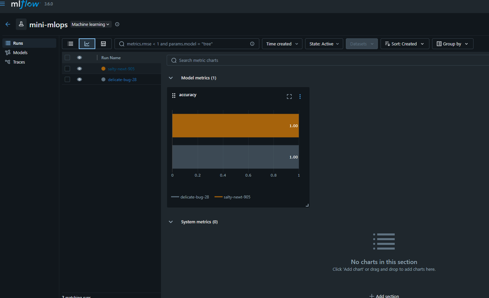
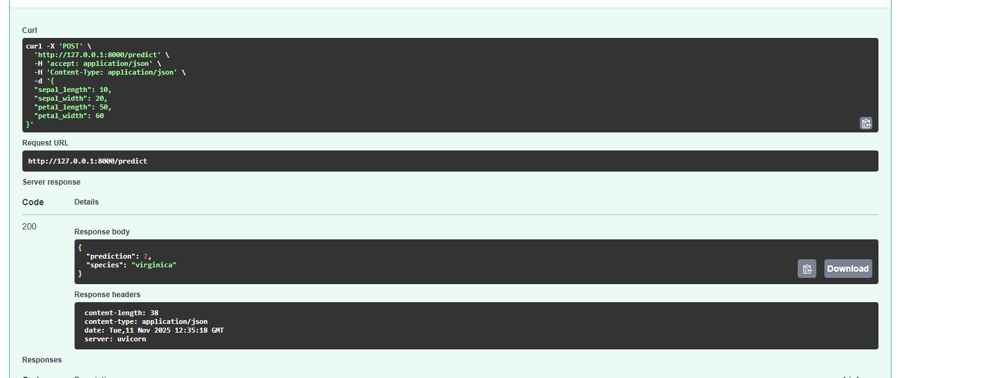

# Mini MLOps Example — Iris classifier

This repository is a compact end-to-end example showing how to train, log, and serve
a scikit-learn model with MLflow and a small FastAPI wrapper.

Contents
- `data/iris.csv` — sample dataset (CSV) used by the project.
- `mlops/` — training, evaluation, and helper utilities.
- `api/` — FastAPI app that loads the latest MLflow run and exposes a `/predict` endpoint.
- `run_train.py` — script that trains a RandomForest model and logs it to MLflow.
- `requirements.txt` — Python dependencies.

Quick summary
- Train a model and log it to MLflow: `python run_train.py`.
- Serve the API: `uvicorn api.main:app --reload` and POST to `/predict`.
Prerequisites
- Python 3.8+ (virtualenv or conda recommended)
- Git (optional)
- Recommended: create and activate a virtual environment, then install requirements.

Install dependencies (PowerShell)
```powershell
python -m pip install --upgrade pip
python -m pip install -r requirements.txt
```

If you prefer conda:
```powershell
conda create -n mlopstsk python=3.10 -y; conda activate mlopstsk
pip install -r requirements.txt
```

Dataset
The dataset used is `data/iris.csv` (standard Iris dataset). The CSV includes the four
feature columns and an integer target. The code in `mlops/train_model.py` uses
scikit-learn's `load_iris()` dataset for training, so the model's numeric labels map to
['setosa', 'versicolor', 'virginica'] by convention.

Training & logging with MLflow
1. Initialize MLflow and run training:

```powershell
python run_train.py
```

This script will:
- initialize MLflow (see `mlops/utils.py`),
- set the experiment name to `mini-mlops`,
- train a RandomForestClassifier (hyperparams visible in `run_train.py`),
- log params/metrics and the trained model to MLflow.

View MLflow UI (default local storage under `mlruns/`):
```powershell
mlflow ui --port 5000
# then open http://127.0.0.1:5000 in your browser
```

Serving the model via FastAPI
The FastAPI app is in `api/main.py`. On startup it attempts to load the latest MLflow run's
model artifact and expose a `/predict` endpoint.

Start the API (PowerShell):
```powershell
uvicorn api.main:app --reload
```

Example request (PowerShell using curl):
```powershell
curl -X POST "http://127.0.0.1:8000/predict" -H "Content-Type: application/json" -d "{
	\"sepal_length\":5.1,
	\"sepal_width\":3.5,
	\"petal_length\":1.4,
	\"petal_width\":0.2
}"
```

Expected JSON response:
```json
{
	"prediction": 0,
	"species": "setosa"
}
```

Notes about model loading
- If the API cannot find a model, it will print a warning and `model` will be `None`.
	The `/predict` endpoint will then return `{"error": "Model not loaded. Please train the model first."}`.
- `api/main.py` contains a robust `get_latest_run_id()` that will search all experiments
	(or filter by name) and return the most recent run id. If you prefer to always load a
	named experiment, set the `MLFLOW_EXPERIMENT_NAME` environment variable and modify the
	code to prefer it.

Testing
- You can add unit tests under a `tests/` folder. A minimal test could call
	`mlops.load_data.load_data()` (or `mlops.train_model.train_model()`) and assert shapes or
	that training returns a fitted estimator.

Troubleshooting
- If imports fail (e.g., `mlflow`, `sklearn`, `pandas`), ensure you installed `requirements.txt` in the
	active environment.
- If `get_latest_run_id()` fails to find runs, verify that `run_train.py` completed and created
	entries under `mlruns/` and that `mlflow ui` shows experiments/runs.

Contributing and next steps
- Save target names with the model (artifact or param) so the serving app doesn't rely on
	`sklearn.datasets.load_iris()` at inference time.
- Add unit tests and CI.
- Provide Dockerfile and containerized MLflow backend/artifacts for production.

License
- This project is provided as-is for educational purposes. Add a LICENSE file if needed.

Contact
- For questions, link issues in the repository or contact the maintainer.

# Mlflow run


# Fast API

